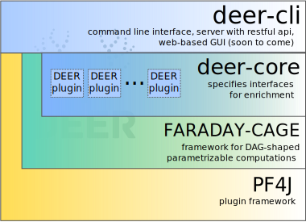

# About DEER

## Architecture

DEERs former execution engine has been outsourced to **FARADAY-CAGE**, a framework that provides
abstractions for nodes in a directed acyclic graph that represent computation steps on homogeneous
data structures which are in turn represented by the graphs edges.  
This kind of graph is called execution graph.

It is dynamically built from an RDF specification by use of PF4J's plugin mechanism.
Graph nodes in **FARADAY-CAGE** are PF4J extension points, which means that every step in the execution
graph is performed by a plugin that is dynamically loaded and automatically parametrized from
the RDF configuration.
**FARADAY-CAGE** will also automatically parallelize plugins based on the graphs structure.  
To learn more about **FARADAY-CAGE**, [check out its manual](https://dice-group.github.io/faraday-cage/)! 

**DEER** itself consists of two modules: *deer-core* and *deer-cli*.
The first is a library that implements a domain model for dataset enrichment on top of **FARADAY-CAGE**
while the latter provides a CLI that can either run a single configuration or spawn a server to 
submit tasks over a RESTful API. In a future release, the API will be accompanied by a web app
to build configurations graphically in the browser.

## DEER Plugin Types

DEERs domain model builds on two utility interfaces which basically are just non-generic reductions
of the corresponding **FARADAY-CAGE** interfaces:
1. `DeerExecutionNode extends ExecutionNode<Model>`
2. `DeerExecutionNodeWrapper extends ExecutionNodeWrapper<DeerExecutionNode, Model>`

## DEER Plugin characteristics

DEER plugins that implement the `DeerExecutionNode` interface inherit from the `ExecutionNode` interface of **FARADAY-CAGE**.
Therefore, they have so called **degree bounds**, which restrict the number of datasets they can accept and emit.
Degree bounds are notated as `(minIn, maxIn, minOut, maxOut)`, where
  * minIn is the minimum number of accepted datasets
  * maxIn is the maximum number of accepted datasets
  * minIn is the minimum number of emitted datasets
  * maxIn is the maximum number of emitted datasets
  
The following three plugin types are derived from `DeerExecutionNode`. For each of them there
exists a convenience abstract class which specifies the according degree bounds and other utility methods.
 
* A **ModelReader** `(0,0,1,1)` is the only plugin that can be a root node in the execution graph and likewise it
must be a root node. It is responsible for reading one RDF dataset from a dedicated source to feed it into 
the exxecution graph.  
* A **ModelWriter** `(1,1,0,1)` can be an intermediary or a leaf node and it will write one RDF dataset to an external channel,
e.g. a file or a triplestore.  
* An **EnrichmentOperator** `(1,N,1,M)` is an intermediary node that takes one or more RDF datasets as input,
executes arbitrary transformations on them and outputs the result as one or more RDF datasets.

